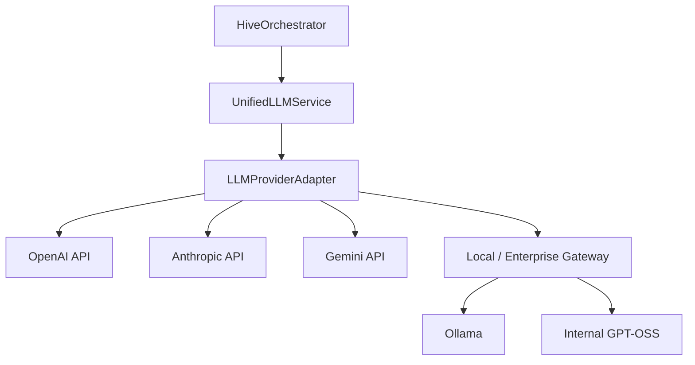

# 🧠 QUEEN BEE : ARCHITECTURE DU MOTEUR LLM (UNIFIED ENGINE)

Cette architecture décrit l'intégration du moteur multi-provider d'OpenClaw dans Queen Bee pour remplacer les mocks actuels.

## 1. VISION GÉNÉRALE
L'objectif est de découpler l'orchestration de Queen Bee du SDK spécifique d'un fournisseur. Nous utilisons une couche d'abstraction inspirée d'OpenClaw pour supporter les modèles Cloud, Locaux et d'Entreprise.



## 2. CONFIGURATION DES MODÈLES LOCAUX
Pour utiliser un modèle local (ex: Ollama ou un proxy d'entreprise), la configuration doit se faire via `config.yaml` ou `models.json`.

### Exemple de configuration pour Ollama
```yaml
models:
  providers:
    ollama:
      baseUrl: "http://localhost:11434/v1"
      api: "openai-completions"
      models:
        - id: "llama3:latest"
          name: "Llama 3 Local"
          contextWindow: 8192
```

### Exemple pour une URL d'entreprise (Proxy)
```yaml
models:
  providers:
    enterprise-proxy:
      baseUrl: "https://proxy.internal.corp/v1"
      api: "openai-completions"
      apiKey: "${INTERNAL_TOKEN}"
      models:
        - id: "gpt-oss-120b"
          name: "Corporate GPT"
```

## 3. PIPELINE D'EXÉCUTION (AGENTIC LOOP)
Le `AutonomousRunner.ts` utilise la boucle **Think -> Act -> Observe** :

1.  **Think** : Le modèle reçoit le contexte (Project Tree, README, TASKS.md) et génère un plan ou un appel d'outil.
2.  **Act** : `ToolExecutor.ts` intercepte l'appel (ex: `write_file`) et l'exécute via `NativeFSManager`.
3.  **Observe** : Le résultat de l'exécution est renvoyé au modèle pour valider l'étape ou corriger une erreur.

## 4. GESTION DES IDENTITÉS ET CLÉS
- **Cloud** : Utilise les clés stockées dans `.env` ou via OAuth dans `AccountStateManager`.
- **Local** : Priorité au `baseUrl` défini dans la config locale pour éviter les fuites de données vers le cloud.
- **Sécurité** : Les jetons sont chiffrés et stockés localement sur la machine de l'utilisateur.

## 5. STANDARDISATION DES I/O
Toutes les réponses des providers sont normalisées en format **OpenResponses** (ou JSON structuré) pour que l'orchestrateur puisse traiter les résultats de manière agnostique au modèle utilisé.
